# 🗄️ Архитектура базы данных: Отношения и ER-диаграмма

## 📋 Анализ отношений и нормализация

### 👤 Отношение `user`
**Зависимости:**
`{id} -> phone, name, email, password_hash, role, avatar_url, created_at, updated_at`

**Обоснование:**
* **1НФ:** Все атрибуты атомарны.
* **2НФ:** Первичный ключ `{id}` состоит из одного атрибута, поэтому частичных зависимостей неключевых атрибутов от PK быть не может.
* **3НФ и НФБК:** В таблице есть 3 потенциальных ключа (`id`, `phone`, `email`). Все остальные атрибуты напрямую зависят от конкретного пользователя и не зависят друг от друга. Транзитивных зависимостей нет.

---

### 🛍️ Отношение `client_profile`
**Зависимости:**
`{account_id} -> bonus_balance, bonus_category_id, bonus_category_expires_at, bonus_expires_at, streak_count, last_order_date, premium_expires_at`

**Обоснование:**
* **1НФ:** Все атрибуты атомарны.
* **2НФ:** Первичный ключ `{account_id}` состоит из одного атрибута, поэтому частичных зависимостей неключевых атрибутов от PK быть не может.
* **3НФ и НФБК:** В таблице есть 1 потенциальный ключ (`account_id`). Все остальные атрибуты напрямую зависят от конкретного клиента и не зависят друг от друга. Транзитивных зависимостей нет.

---

### 🛵 Отношение `courier_profile`
**Зависимости:**
`{account_id} -> status`

**Обоснование:**
* **1НФ:** Все атрибуты атомарны.
* **2НФ:** Первичный ключ `{account_id}` состоит из одного атрибута, поэтому частичных зависимостей неключевых атрибутов от PK быть не может.
* **3НФ и НФБК:** В таблице есть 1 потенциальный ключ (`account_id`). Все остальные атрибуты напрямую зависят от конкретного курьера и не зависят друг от друга. Транзитивных зависимостей нет.

---

### 👔 Отношение `owner_profile`
**Зависимости:**
`{account_id} -> restaurant_brand_id

**Обоснование:**
* **1НФ:** Все атрибуты атомарны.
* **2НФ:** Первичный ключ `{account_id}` состоит из одного атрибута, поэтому частичных зависимостей неключевых атрибутов от PK быть не может.
* **3НФ и НФБК:** В таблице есть 1 потенциальный ключ (`account_id`). Все остальные атрибуты напрямую зависят от конкретного владельца и не зависят друг от друга. Транзитивных зависимостей нет.

---

### 🏢 Отношение `restaurant_brand`
**Зависимости:**
`{id} -> name, description, promotion_tier, logo_url, banner_url, created_at, updated_at`

**Обоснование:**
* **1НФ:** Все атрибуты атомарны.
* **2НФ:** Первичный ключ `{id}` состоит из одного атрибута, поэтому частичных зависимостей неключевых атрибутов от PK быть не может.
* **3НФ и НФБК:** В таблице есть 1 потенциальный ключ (`id`). Все остальные атрибуты напрямую зависят от конкретного предприятия и не зависят друг от друга. Транзитивных зависимостей нет.

---

### 🏪 Отношение `restaurant_branch`
**Зависимости:**
`{id} -> brand_id, location_id, open_time, close_time, created_at, updated_at`

**Обоснование:**
* **1НФ:** Все атрибуты атомарны.
* **2НФ:** Первичный ключ `{id}` состоит из одного атрибута, поэтому частичных зависимостей неключевых атрибутов от PK быть не может.
* **3НФ и НФБК:** В таблице есть 1 потенциальный ключ (`id`). Все остальные атрибуты напрямую зависят от конкретного предприятия и не зависят друг от друга. Транзитивных зависимостей нет.

---

### 📦 Отношение `order`
**Зависимости:**
`{id} -> client_account_id, courier_account_id, restaurant_branch_id, client_address_id, promocode_id, status, created_at, updated_at`

**Обоснование:**
* **1НФ:** Все атрибуты атомарны.
* **2НФ:** Первичный ключ `{id}` состоит из одного атрибута, поэтому частичных зависимостей неключевых атрибутов от PK быть не может.
* **3НФ и НФБК:** В таблице есть 1 потенциальный ключ (`id`). Все остальные атрибуты напрямую зависят от конкретного заказа и не зависят друг от друга. Транзитивных зависимостей нет.

---

### 🍲 Отношение `order_dish`
**Зависимости:**
`{order_id, dish_id} -> quantity, price, created_at`

**Обоснование:**
* **1НФ:** Все атрибуты атомарны.
* **2НФ:** Первичный ключ `{order_id}, {dish_id}` состоит из двух атрибутов, но неключевые атрибуты зависят одновременно от этих двух ключевых атрибутов (в данном случае они не могут зависеть только от одного).
* **3НФ и НФБК:** Отношение находится в 3НФ и НФБК, так как все функциональные зависимости сводятся к зависимости от `{order_id}` и `{dish_id}` одновременно. Также нет транзитивных зависимостей (ни один неключевой атрибут не зависит от другого неключевого атрибута).

> 💡 **Примечание:** Атрибут `updated_at` здесь не нужен, так как состав заказа фиксируется 1 раз при создании.

---

### ⭐ Отношение `order_review`
**Зависимости:**
`{order_id} -> restaurant_rating, courier_rating, client_comment, created_at`

**Обоснование:**
* **1НФ:** Все атрибуты атомарны.
* **2НФ:** Первичный ключ `{order_id}` состоит из одного атрибута, поэтому частичных зависимостей неключевых атрибутов от PK быть не может.
* **3НФ и НФБК:** В таблице есть 1 потенциальный ключ (`order_id`). Все остальные атрибуты напрямую зависят от конкретного отзыва и не зависят друг от друга. Транзитивных зависимостей нет.

> 💡 **Примечание:** Атрибут `updated_at` здесь не нужен, так как отзыв на заказ оставляется 1 раз.

---

### 🍕 Отношение `dish`
**Зависимости:**
`{id} -> restaurant_brand_id, name, description, image_url, price, created_at, updated_at`

**Обоснование:**
* **1НФ:** Все атрибуты атомарны.
* **2НФ:** Первичный ключ `{id}` состоит из одного атрибута, поэтому частичных зависимостей неключевых атрибутов от PK быть не может.
* **3НФ и НФБК:** В таблице есть 1 потенциальный ключ (`id`). Все остальные атрибуты напрямую зависят от конкретного блюда и не зависят друг от друга. Транзитивных зависимостей нет.

> 💡 **Примечание:** Атрибут `price` не нарушает 3НФ, поскольку в `dish` — это текущая цена блюда, а в `order_dish` — историческая стоимость блюда (зафиксированная в момент заказа).

---

### 🎟️ Отношение `promocode`
**Зависимости:**
`{id} -> code, discount_percent, discount_amount, is_global, created_at, expires_at`

**Обоснование:**
* **1НФ:** Все атрибуты атомарны.
* **2НФ:** Первичный ключ `{id}` состоит из одного атрибута, поэтому частичных зависимостей неключевых атрибутов от PK быть не может.
* **3НФ и НФБК:** В таблице есть 2 потенциальных ключа (`id`, `code`). Все остальные атрибуты напрямую зависят от конкретного промокода и не зависят друг от друга. Транзитивных зависимостей нет.

---

### 🔗 Отношение `promocode_restaurant_brand`
**Зависимости:**
`{promocode_id, restaurant_brand_id}`

**Обоснование:**
* **Высшие НФ:** Автоматически находится в высшей НФ, поскольку состоит только из составного PK.

---

### 🔗 Отношение `promocode_category`
**Зависимости:**
`{promocode_id, category_id}`

**Обоснование:**
* **Высшие НФ:** Автоматически находится в высшей НФ, поскольку состоит только из составного PK.

---

### 🏷️ Отношение `category`
**Зависимости:**
`{id} -> name, created_at, updated_at`

**Обоснование:**
* **1НФ:** Все атрибуты атомарны.
* **2НФ:** Первичный ключ `{id}` состоит из одного атрибута, поэтому частичных зависимостей неключевых атрибутов от PK быть не может.
* **3НФ и НФБК:** В таблице есть 2 потенциальных ключа (`id`, `name`). Все остальные атрибуты напрямую зависят от конкретной категории и не зависят друг от друга. Транзитивных зависимостей нет.

---

### 🔗 Отношение `restaurant_brand_category`
**Зависимости:**
`{restaurant_brand_id, category_id}`

**Обоснование:**
* **Высшие НФ:** Автоматически находится в высшей НФ, поскольку состоит только из составного PK.

---

### 🔗 Отношение `dish_category`
**Зависимости:**
`{dish_id, category_id}`

**Обоснование:**
* **Высшие НФ:** Автоматически находится в высшей НФ, поскольку состоит только из составного PK.

---

### 📍 Отношение `location`
**Зависимости:**
`{id} -> address_text, latitude, longitude, created_at, updated_at`

**Обоснование:**
* **1НФ:** Все атрибуты атомарны.
* **2НФ:** Первичный ключ `{id}` состоит из одного атрибута, поэтому частичных зависимостей неключевых атрибутов от PK быть не может.
* **3НФ и НФБК:** В таблице есть 1 потенциальный ключ (`id`). Все остальные атрибуты напрямую зависят от конкретной локации и не зависят друг от друга. Транзитивных зависимостей нет.

---

### 🏠 Отношение `client_address`
**Зависимости:**
`{id} -> location_id, client_account_id, apartment, entrance, floor, door_code, courier_comment, label, created_at, updated_at`

**Обоснование:**
* **1НФ:** Все атрибуты атомарны.
* **2НФ:** Первичный ключ `{id}` состоит из одного атрибута, поэтому частичных зависимостей неключевых атрибутов от PK быть не может.
* **3НФ и НФБК:** В таблице есть 1 потенциальный ключ (`id`). Все остальные атрибуты напрямую зависят от конкретного адреса и не зависят друг от друга. Транзитивных зависимостей нет.

---

### 🔗 Отношение `cart`
**Зависимости:**
`{client_account_id, restaurant_brand_id} -> updated_at`

**Обоснование:**
* **Высшие НФ:** Автоматически находится в высшей НФ, поскольку состоит только из составного PK.

---

### 🔗 Отношение `cart_dish`
**Зависимости:**
`{client_account_id, dish_id} -> quantity, created_at, updated_at`

**Обоснование:**
* **Высшие НФ:** Автоматически находится в высшей НФ, поскольку состоит только из составного PK.

---

### 🔴 Хранилище `Redis_Session_Store` (Key-Value)
**Зависимости (концептуально):**
`{key (например, user_id:session_token)} -> info (токены, сессии)`

**Обоснование:**
* Является in-memory NoSQL хранилищем. Строгие правила классической реляционной нормализации (1НФ–3НФ) здесь не применяются. 
* Используется для обеспечения сверхбыстрого доступа к временно живущим данным. Данные (состояние сессии, токены авторизации) могут храниться в денормализованном виде (например, целой JSON-строкой или Hash-структурой).

 

## 🗺️ ER-диаграмма

```mermaid
erDiagram
    %% Описание сущностей
    user {
        int id PK
        text phone UK "NOT NULL, UNIQUE"
        text name "NOT NULL"
        text email UK "NOT NULL, UNIQUE"
        text password_hash "NOT NULL"
        enum role "NOT NULL"
        text avatar_url
        datetime created_at "DEFAULT NOW(), NOT NULL"
        datetime updated_at "DEFAULT NOW(), NOT NULL"
    }

    client_profile {
        int account_id PK, FK
        int bonus_balance
        int bonus_category_id FK
        datetime bonus_category_expires_at
        datetime bonus_expires_at
        int streak_count
        datetime last_order_date
        datetime premium_expires_at
    }
    
    courier_profile {
        int account_id PK, FK
        text status "NOT NULL"
    }

    owner_profile {
        int account_id PK, FK
        int restaurant_brand_id FK
    }

    restaurant_brand {
        int id PK
        text name "NOT NULL"
        text description
        int promotion_tier
        text logo_url
        text banner_url
        datetime created_at "DEFAULT NOW()"
        datetime updated_at "DEFAULT NOW()"
    }

    restaurant_branch {
        int id PK
        int brand_id FK
        int location_id FK
        time open_time
        time close_time
        datetime created_at "DEFAULT NOW()"
        datetime updated_at "DEFAULT NOW()"
    }

    order {
        int id PK
        int client_account_id FK "NOT NULL"
        int courier_account_id FK "SET NULL"
        int restaurant_branch_id FK "NOT NULL"
        int client_address_id FK "NOT NULL"
        int promocode_id FK
        text status "NOT NULL"
        datetime created_at "DEFAULT NOW()"
        datetime updated_at "DEFAULT NOW()"
    }

    order_dish {
        int order_id PK, FK
        int dish_id PK, FK
        int quantity "NOT NULL"
        int price "NOT NULL"
        datetime created_at "DEFAULT NOW()"
    }

    order_review {
        int order_id PK, FK
        int restaurant_rating "NOT NULL"
        int courier_rating "NOT NULL"
        text client_comment
        datetime created_at "DEFAULT NOW()"
    }

    dish {
        int id PK
        int restaurant_brand_id FK "NOT NULL"
        text name "NOT NULL"
        text description
        text image_url
        int price "NOT NULL"
        datetime created_at "DEFAULT NOW()"
        datetime updated_at "DEFAULT NOW()"
    }

    promocode {
        int id PK
        text code UK "NOT NULL, UNIQUE"
        int discount_percent
        int discount_amount
        boolean is_global
        datetime created_at "DEFAULT NOW()"
        datetime expires_at "NOT NULL"
    }

    promocode_restaurant_brand {
        int promocode_id PK, FK
        int restaurant_brand_id PK, FK
    }

    promocode_category {
        int promocode_id PK, FK
        int category_id PK, FK
    }

    category {
        int id PK
        text name UK "UNIQUE"
        datetime created_at "DEFAULT NOW()"
        datetime updated_at "DEFAULT NOW()"
    }

    restaurant_brand_category {
        int restaurant_brand_id PK, FK
        int category_id PK, FK
    }

    dish_category {
        int dish_id PK, FK
        int category_id PK, FK
    }

    location {
        int id PK
        text address_text
        %% latitude - широта; longitude - долгота
        numeric latitude
        numeric longitude
        datetime created_at "DEFAULT NOW()"
        datetime updated_at "DEFAULT NOW()"
    }

    client_address {
        int id PK
        int location_id FK
        int client_account_id FK
        text apartment
        text entrance
        text floor
        text door_code
        text courier_comment
        text label "House, work, etc"
        datetime created_at "DEFAULT NOW()"
        datetime updated_at "DEFAULT NOW()"
    }

    cart {
        int client_account_id PK, FK
        int restaurant_brand_id PK, FK
        datetime updated_at "DEFAULT NOW()"
    }

    cart_dish {
        int client_account_id PK, FK
        int dish_id PK, FK
        int quantity "NOT NULL"
        datetime created_at "DEFAULT NOW()"
        datetime updated_at "DEFAULT NOW()"
    }

    %% Фейковая табличка редиса
    Redis_Session_Store {
        text info "Токены, сессии"
    }

    %% Описание связей
    user ||--|| client_profile: ""
    user ||--|| courier_profile: ""
    user ||--|| owner_profile: ""
    user ||--|{ Redis_Session_Store: ""

    courier_profile ||--o{ order: ""

    restaurant_brand ||--|{ restaurant_branch: ""
    restaurant_brand ||--|{ dish: ""
    restaurant_brand ||--o{ restaurant_brand_category: ""
    restaurant_brand ||--o{ promocode_restaurant_brand: ""
    restaurant_brand ||--|| owner_profile: ""
    restaurant_brand ||--o{ cart: ""

    restaurant_branch ||--o{ order: ""

    category ||--o{ client_profile: ""
    category ||--o{ dish_category: ""
    category ||--o{ promocode_category: ""
    category ||--o{ restaurant_brand_category: ""

    promocode ||--o{ order: ""
    promocode ||--o{ promocode_category: ""
    promocode ||--o{ promocode_restaurant_brand: ""

    order ||--|{ order_dish: ""
    order ||--o| order_review: ""

    dish ||--o{ order_dish: ""
    dish ||--|{ dish_category: ""
    dish ||--o{ cart_dish: ""

    cart ||--o{ cart_dish: ""

    location ||--o{ client_address: ""
    location ||--o{ restaurant_branch: ""

    client_profile ||--o{ client_address: ""
    client_profile ||--o{ order: ""
    client_profile ||--|| cart: ""

    client_address ||--o{ order: ""
```

