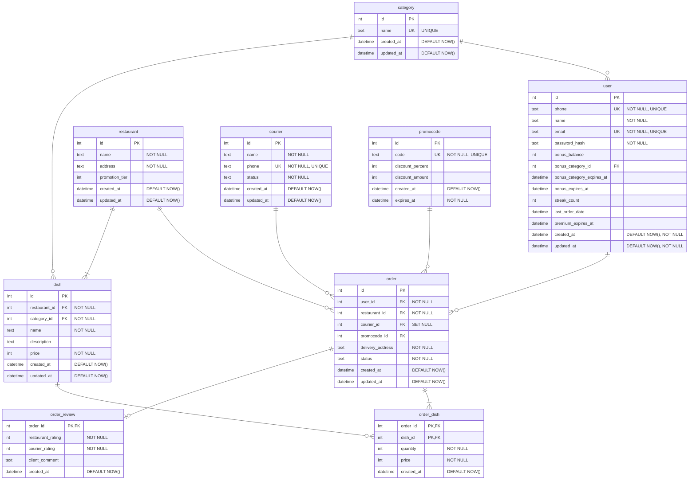

Relation user:
{id} -> phone, name, email, password_hash, bonus_balance, bonus_category_id, bonus_category_expires_at, bonus_expires_at, streak_count, last_order_date, premium_expires_at, created_at, updated_at

Обоснование:
Отношение в 1НФ: все атрибуты атомарны
Отношение во 2НФ: первичный ключ `{id}` состоит из одного атрибута, поэтому частичных зависимостей неключевых атрибутов от PK быть не может
Отношение в 3НФ и НФБК: в таблице есть 3 потенциальных ключа (id, phone, email). Все остальные атрибуты напрямую зависят от конкретного пользователя и не зависят друг от друга. Транзитивных зависимостей нет

Relation restaurant:
{id} -> name, address, promotion_tier, created_at, updated_at

Обоснование:
Отношение в 1НФ: все атрибуты атомарны
Отношение во 2НФ: первичный ключ `{id}` состоит из одного атрибута, поэтому частичных зависимостей неключевых атрибутов от PK быть не может
Отношение в 3НФ и НФБК: в таблице есть 1 потенциальный ключ (id). Все остальные атрибуты напрямую зависят от конкретного предприятия и не зависят друг от друга. Транзитивных зависимостей нет

Relation order:
{id} -> user_id, restaurant_id, courier_id, promocode_id, delivery_address, status, created_at, updated_at

Обоснование:
Отношение в 1НФ: все атрибуты атомарны
Отношение во 2НФ: первичный ключ `{id}` состоит из одного атрибута, поэтому частичных зависимостей неключевых атрибутов от PK быть не может
Отношение в 3НФ и НФБК: в таблице есть 1 потенциальный ключ (id). Все остальные атрибуты напрямую зависят от конкретного заказа и не зависят друг от друга. Транзитивных зависимостей нет

Relation order_dish:
{order_id, dish_id} -> quantity, price, created_at

Обоснование:
Отношение в 1НФ: все атрибуты атомарны
Отношение во 2НФ: первичный ключ `{order_id}, {dish_id}` состоит из двух атрибутов, но неключевые атрибуты зависят одновременно от этих двух ключевых атрибутов (они не могут зависеть только от одного, в данном случае)
Отношение находится в  3НФ и НФБК, так как все функциональные зависимости сводятся к зависимости от ({order_id}) и ({dish_id}) одновременно. Также нет транзитивных зависимостей (ни один неключевой атрибут на зависит от другого неключевого атрибута)

updated_at тут не нужен, так как заказ создается 1 раз

Relation order_review:
{order_id} -> restaurant_rating, courier_rating, client_comment, created_at

Обоснование:
Отношение в 1НФ: все атрибуты атомарны
Отношение во 2НФ: первичный ключ `{order_id}` состоит из одного атрибута, поэтому частичных зависимостей неключевых атрибутов от PK быть не может
Отношение в 3НФ и НФБК: в таблице есть 1 потенциальный ключ (order_id). Все остальные атрибуты напрямую зависят от конкретного отзыва и не зависят друг от друга. Транзитивных зависимостей нет

updated_at тут не нужен, так как отзыв на заказ оставляется 1 раз

Relation dish:
{id} -> restaurant_id, category_id, name, description, price, created_at, updated_at

Обоснование:
Отношение в 1НФ: все атрибуты атомарны
Отношение во 2НФ: первичный ключ `{id}` состоит из одного атрибута, поэтому частичных зависимостей неключевых атрибутов от PK быть не может
Отношение в 3НФ и НФБК: в таблице есть 1 потенциальный ключ (id). Все остальные атрибуты напрямую зависят от конкретного блюда и не зависят друг от друга. Транзитивных зависимостей нет

price не нарушает 3НФ, поскольку в dish - это текущая цена блюда, а в order_dish - историческая стоимость блюда (в бывшем заказе)

Relation category:
{id} -> name, created_at, updated_at

Обоснование:
Отношение в 1НФ: все атрибуты атомарны
Отношение во 2НФ: первичный ключ `{id}` состоит из одного атрибута, поэтому частичных зависимостей неключевых атрибутов от PK быть не может
Отношение в 3НФ и НФБК: в таблице есть 2 потенциальных ключа (id, name). Все остальные атрибуты напрямую зависят от конкретной категории и не зависят друг от друга. Транзитивных зависимостей нет

Relation courier:
{id} -> name, phone, status, created_at, updated_at

Обоснование:
Отношение в 1НФ: все атрибуты атомарны
Отношение во 2НФ: первичный ключ `{id}` состоит из одного атрибута, поэтому частичных зависимостей неключевых атрибутов от PK быть не может
Отношение в 3НФ и НФБК: в таблице есть 2 потенциальных ключа (id, phone). Все остальные атрибуты напрямую зависят от конкретного курьера и не зависят друг от друга. Транзитивных зависимостей нет

Relation promocode:
{id} -> code, discount_percent, discount_amount, created_at, expires_at

Обоснование:
Отношение в 1НФ: все атрибуты атомарны
Отношение во 2НФ: первичный ключ `{id}` состоит из одного атрибута, поэтому частичных зависимостей неключевых атрибутов от PK быть не может
Отношение в 3НФ и НФБК: в таблице есть 2 потенциальных ключа (id, code). Все остальные атрибуты напрямую зависят от конкретного промокода и не зависят друг от друга. Транзитивных зависимостей нет

