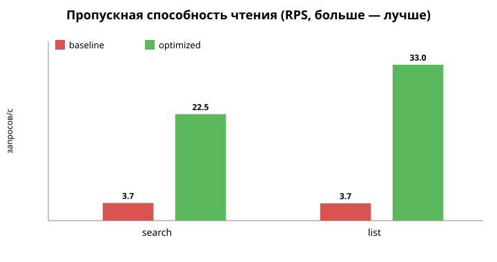
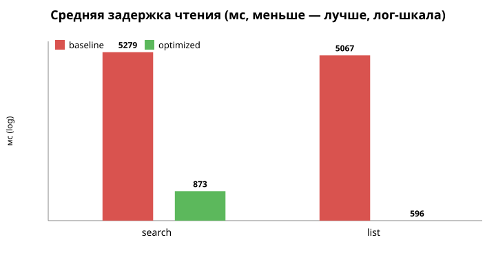

# ДЗ4 — Нагрузочное тестирование и оптимизация СУБД

Сервис доставки еды **FoodCourt** (Go-микросервисы + PostgreSQL 18). Документ описывает
полный цикл нагрузочного тестирования и оптимизации основной сущности приложения:
нагрузка → описание результатов → поиск бутылочного горлышка → оптимизация → повтор.

---

## 1. Выбор сущности и эндпоинтов

**Основная сущность — «ресторанный бренд» (`restaurant_brand`)**, сервис `restaurant`.
Это каталог ресторанов — то, что пользователь видит и ищет в первую очередь, ядро
бизнес-ценности витрины доставки. Тестируем пару эндпоинтов API Gateway:

| Операция | HTTP endpoint | Что внутри (SQL) |
|---|---|---|
| **CREATE** | `POST /api/owner/restaurants` (multipart, роль `owner` + CSRF) | `INSERT INTO restaurant_brand ... ON CONFLICT (idempotency_key)` |
| **READ: поиск** | `GET /api/restaurants/search?q=...` | `... WHERE name ILIKE '%q%' OR description ILIKE '%q%' ORDER BY promotion_tier DESC, id` |
| **READ: листинг** | `GET /api/restaurants/brands?limit&offset` | `... ORDER BY promotion_tier DESC, id ASC LIMIT $1 OFFSET $2` |

Путь запроса (не упрощали, бьём настоящий публичный API):
`vegeta → API Gateway (:8080, HTTP) → restaurant (gRPC :50053) → PostgreSQL`.
Для CREATE добавляются проверки в `auth` (CheckSession + CSRF через Redis).

---

## 2. Стенд

Тесты прогонялись на **выделенной виртуалке** (по SSH):

| Параметр | Значение |
|---|---|
| CPU / RAM | **1 vCPU, 3.8 GB** |
| ОС | Ubuntu 24.04, ядро 6.8 |
| СУБД | PostgreSQL 18 (`postgis/postgis:18-3.6-alpine`) |
| Инструмент нагрузки | **vegeta v12.12.0** |

На VM уже работает прод-деплой в `k3s`. Чтобы **не трогать прод-БД**, перф-тест
поднимает полностью **изолированный стенд** в Docker (свои `postgres`/`redis`/`rabbitmq`
на хост-портах, отдельные базы `auth_db`/`user_db`/`restaurant_db`) и запускает 4 нужных
сервиса (`auth`, `user`, `restaurant`, `api-gateway`) нативно из бинарников.

> ⚠️ **Про абсолютные числа.** 1 vCPU — это намеренно слабый, но изолированный хост.
> Генератор нагрузки, 4 сервиса и Postgres делят одно ядро, поэтому абсолютный RPS
> невысокий. Важны **относительные** улучшения «до/после» при идентичной нагрузке —
> именно они показывают эффект оптимизаций СУБД.

---

## 3. Как воспроизвести (в три действия)

```bash
# 0) на VM, из каталога репозитория
cd ~/perf/2026_1_NaNcats/perf_test

# 1) ЗАПУСК — полный цикл: стенд + 100k + baseline + 2 оптимизации + перезамер + графики
bash scripts/run_all.sh

# 2) АНАЛИЗ — смотрим отчёты
ls results/                       # *.txt (vegeta), explain_*.txt, *.svg

# 3) ДОКУМЕНТИРОВАНИЕ — этот README
```

Скрипты (каталог `scripts/`, подробности — в шапке каждого файла):

| Скрипт | Назначение |
|---|---|
| `00_prereqs.sh` | Установка Go, vegeta, golang-migrate |
| `01_infra_up.sh` | Docker: postgres + redis + rabbitmq, создание БД |
| `02_migrate.sh` | Миграции схемы (restaurant → версия **8**, baseline) + дамп `init.sql` |
| `03_services_up.sh` | Сборка и запуск 4 сервисов |
| `04_provision_owner.sh` | Сессия owner (register → promote → login) → `.run/creds.env` |
| `05_load_create.sh` | Заливка 100k через эндпоинт создания |
| `06_load_read.sh` | Нагрузка на search + list |
| `07_optimize.sh N` | Применить оптимизацию до версии миграции N (9 или 10) |
| `explain.sh TAG` | Снять `EXPLAIN (ANALYZE, BUFFERS)` |
| `down.sh` | Погасить стенд |

**Инструмент** (`tools/`): `gen/main.go` — генератор целей vegeta (на Go, без SQL-билдеров,
только stdlib). Графики в `results/*.svg` — статические картинки, построенные один раз
из JSON-отчётов vegeta; для воспроизведения тестов не требуются.

**Генерация данных.** Имена брендов уникальны (`perf_<номер>_<rand>`, ≤ 60 символов),
описания случайны. Уникальный `Idempotency-Key` на каждую заявку → **ровно N строк**:
даже если vegeta пошлёт цель повторно, `ON CONFLICT (idempotency_key) DO UPDATE` не
создаст дубль. Источник истины по факту заливки — `SELECT count(*)`.

`init.sql` — исходный DDL `restaurant_db` **до оптимизаций** (снят на версии миграций 8).

---

## 4. Итерация 0 — Baseline

### 4.1 CREATE: заливка 100 000 ресторанов

`POST /api/owner/restaurants`, 30 воркеров, максимальная скорость.

```
Requests   [total, rate, throughput]   100001, 281.70, 281.66
Duration                               5m55s
Latencies  [mean, p50, p90, p95, p99, max]
                                       106.46ms, 103.06ms, 141.12ms, 154.85ms, 192.28ms, 475.25ms
Success                                100.00%
Status Codes                           201:100000   (+1 холостой запрос vegeta на EOF)
```
В БД создано **ровно 100 000** строк (`SELECT count(*) = 100000`).
Полные отчёты: [`results/create_baseline.txt`](results/create_baseline.txt) / `.json`.

Вывод: путь создания упирается в CPU прикладного слоя (HTTP+gRPC+auth+CSRF на 1 ядре),
а не в саму вставку; держит ~**282 RPS** стабильно, без ошибок.

### 4.2 READ на заполненной базе (100k), без перф-индексов

30с, 20 воркеров, максимальная скорость.

| Эндпоинт | Throughput (RPS) | mean | p90 | p99 |
|---|---|---|---|---|
| **search** | **3.74** | 5.28 с | 8.46 с | 9.81 с |
| **list** | **3.68** | 5.07 с | 5.77 с | 6.19 с |

Чтение **разваливается** под конкуренцией: единицы RPS, задержки в секунды.

### 4.3 Поиск горлышка — `EXPLAIN (ANALYZE, BUFFERS)`

**search** ([`results/explain_search_baseline.txt`](results/explain_search_baseline.txt)):
```
Limit ... (actual time=183.5..190.8)
  -> Gather Merge (Workers Planned: 2)
       -> Sort (top-N heapsort)  Sort Key: promotion_tier DESC, id
            -> Parallel Seq Scan on restaurant_brand
                 Filter: (name ~~* '%perf%' OR description ~~* '%perf%')
 Execution Time: 190.986 ms
```
**list**, deep offset 50000 ([`results/explain_list_baseline.txt`](results/explain_list_baseline.txt)):
```
Limit ... (actual time=291.0..314.2)
  -> Gather Merge
       -> Sort  Sort Method: external merge  Disk: 8408kB   ← сортировка в temp-файл
            -> Parallel Seq Scan on restaurant_brand
 Execution Time: 316.831 ms
```

**Диагноз:**
1. У `restaurant_brand` нет индексов, кроме `PK` и `UNIQUE(name)`, `UNIQUE(idempotency_key)`.
2. **search**: `ILIKE '%...%'` → `Seq Scan` всех 100k строк на каждый запрос.
3. **list**: `ORDER BY ... OFFSET` → `Seq Scan` + полная сортировка 100k строк, ещё и
   **со сбросом на диск** (`external merge`).
4. На 1 ядре каждый запрос ещё и планирует **2 параллельных воркера** — при 20 одновременных
   запросах ядро многократно переподписано, отсюда задержки в секунды.

---

## 5. Итерация 1 — Триграммный индекс для поиска (миграция `000009`)

`SearchRestaurantBrands` ищет подстроку (`ILIKE '%q%'`) сразу по двум колонкам. Решение —
GIN-индексы `pg_trgm`, которые планировщик объединяет через `BitmapOr`:

```sql
CREATE EXTENSION IF NOT EXISTS pg_trgm;
CREATE INDEX idx_restaurant_brand_name_trgm        ON restaurant_brand USING gin (name gin_trgm_ops);
CREATE INDEX idx_restaurant_brand_description_trgm ON restaurant_brand USING gin (description gin_trgm_ops);
```
(файл `services/restaurant/db/migrations/000009_perf_search_trgm_index.up.sql`)

**EXPLAIN после** для селективного запроса `q='xyz'`
([`results/explain_search_opt_selective.txt`](results/explain_search_opt_selective.txt)):
```
Limit ... (actual time=1.26..1.27)
  -> Sort (top-N heapsort)
       -> Bitmap Heap Scan on restaurant_brand
            -> BitmapOr
                 -> Bitmap Index Scan on idx_restaurant_brand_name_trgm
                 -> Bitmap Index Scan on idx_restaurant_brand_description_trgm
 Execution Time: 1.540 ms        ← было 190.986 ms (~124× быстрее на запросе)
```

**Нагрузка после** (та же, 30с/20 воркеров):

| search | Throughput | mean | p99 |
|---|---|---|---|
| baseline | 3.74 RPS | 5.28 с | 9.81 с |
| **+ trgm** | **22.54 RPS** | **0.87 с** | 2.61 с |

→ **×6 по RPS, задержка ÷6.**

> Нюанс: для неселективного `q='perf'` (совпадает со **всеми** строками) планировщик
> по-прежнему выбирает `Seq Scan` — и это правильно: индекс бесполезен, когда вернуть
> надо почти всю таблицу. Триграммный индекс выигрывает на **селективных** запросах,
> которых в реальном трафике большинство; они и дают ускорение нагрузки в 6 раз.

---

## 6. Итерация 2 — Составной btree для листинга (миграция `000010`)

`GetRestaurantBrandsList` всегда сортирует по `promotion_tier DESC, id ASC`. Индекс в
точном порядке сортировки убирает сортировку и сброс на диск:

```sql
CREATE INDEX idx_restaurant_brand_tier_id ON restaurant_brand (promotion_tier DESC, id ASC);
```
(файл `services/restaurant/db/migrations/000010_perf_brand_list_index.up.sql`)

**EXPLAIN после**, offset 50000 ([`results/explain_list_opt.txt`](results/explain_list_opt.txt)):
```
Limit ... (actual time=35.5..35.5)
  -> Index Scan using idx_restaurant_brand_tier_id on restaurant_brand
 Execution Time: 35.633 ms       ← было 316.831 ms (~9× быстрее); ушли Sort и temp-файл
```

**Нагрузка после** (та же, 30с/20 воркеров):

| list | Throughput | mean | p99 |
|---|---|---|---|
| baseline | 3.68 RPS | 5.07 с | 6.19 с |
| **+ btree** | **33.00 RPS** | **0.60 с** | 1.03 с |

→ **×9 по RPS, задержка ÷8.**

---

## 7. Стоимость записи при наличии индексов

Индексы ускоряют чтение, но замедляют запись. Перезамерили CREATE с тремя новыми
индексами (партия 5000 новых брендов):

| CREATE | Throughput | mean |
|---|---|---|
| baseline (без индексов) | 281.66 RPS | 106 мс |
| с 3 индексами | **277.16 RPS** | 108 мс |

Потеря записи ~**1.6%** — пренебрежимо мала: на этом стенде вставка упирается в CPU
прикладного слоя, а не в поддержку индексов. Размеры индексов: `name_trgm` 11 MB,
`description_trgm` 30 MB, `tier_id` 3.2 MB (таблица 34 MB). Размен честный: ~6–9× на
чтении за ~1.6% записи.

---

## 8. Сводка и графики




| Эндпоинт | Метрика | Baseline | После оптимизации | Δ |
|---|---|---|---|---|
| **search** | RPS | 3.74 | **22.54** | **×6.0** |
| **search** | mean | 5.28 с | **0.87 с** | **÷6.1** |
| **search** | SQL (EXPLAIN) | 190.99 мс | **1.54 мс** | **÷124** |
| **list** | RPS | 3.68 | **33.00** | **×9.0** |
| **list** | mean | 5.07 с | **0.60 с** | **÷8.5** |
| **list** | SQL (EXPLAIN) | 316.83 мс | **35.63 мс** | **÷8.9** |
| **create** | RPS | 281.66 | 277.16 (с индексами) | −1.6% |

Гистограммы задержек — в выводе `vegeta report -type=hist`
(см. `results/*.txt`); файлы `results/read_*_{baseline,opt}.json` содержат полные перцентили.

---

## 9. Выводы и дальнейшие шаги

**Что сделали.** Прошли два полных цикла «тест → анализ → оптимизация → перезамер».
Узкие места — последовательные сканирования и сортировки `restaurant_brand` на 100k
строк — устранены адресными индексами (`pg_trgm` для поиска, составной btree для
листинга). Чтение ускорилось в **6–9 раз** под идентичной нагрузкой ценой ~1.6% записи.

**Куда расти дальше (вне объёма ДЗ):**
- **Keyset-пагинация** вместо `OFFSET`: при больших offset `Index Scan` всё ещё проходит
  `offset` записей (в плане видно `Buffers: shared hit=45994`). Переход на
  `WHERE (promotion_tier, id) < (...)` сделает листинг O(limit) вместо O(offset).
- Индекс `dish(restaurant_brand_id)` — для `GetDishesByRestaurantBrandID` (не тестировался,
  но симметричная проблема Seq Scan).
- Тюнинг `pgxpool` (явный размер пула) и отключение `parallel_workers` на 1-ядерном хосте
  (`max_parallel_workers_per_gather = 0`) — параллельные воркеры здесь только вредят.

---

## 10. Структура каталога

```
perf_test/
├── README.md                  # этот отчёт
├── init.sql                   # исходный DDL restaurant_db (до оптимизаций)
├── scripts/                   # воспроизводимый прогон (00..07, explain, run_all, down)
├── tools/
│   └── gen/main.go            # генератор целей vegeta (create/search/list), на Go
└── results/                   # отчёты vegeta (.txt/.json), EXPLAIN'ы, графики (.svg)
```

Сами оптимизации лежат как миграции golang-migrate в основном дереве сервиса:
`services/restaurant/db/migrations/000009_*`, `000010_*` (с `up`/`down`).
